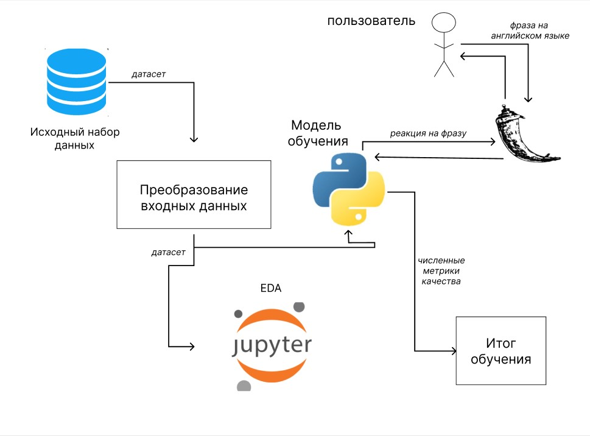

# ML System Design
## 1. Цели и предпосылки
   
### 1.1. Зачем идем в разработку продукта?
   - **Бизнес-цель**: Создание модели, способной автоматически определять наличие ненависти в тексте с высокой точностью.
   - **Польза от использования ML**: Улучшение пользовательского опыта за счет быстрой оценки текстов на наличие негативного содержания.
   - **Успех итерации**: Успехом для данного проекта с точки зрения бизнеса считаются две вещи. Во-первых, снижение затрат, которые несут в себе отслеживание гневных/ругательных сообщений в режиме реального времени. И во-вторых, возможность быстрой реакции на подобные сообщения.

### 1.2 Бизнес-требования и ограничения:
   - **Бизнес-требования**: На вход поступает сообщение от пользователя. Система должна классифицировать сообщение как ругательное или нет. В случае неопределённости выдавать сообщение об этом.
   - **Бизнес-ограничения**:  Язык сообщений - английский
   - **Успешный пилот**: Система должна успешно классифицировать тексты на наличие ненависти в соответствии с ожиданиями бизнеса.

## 2. Методология

### 2.1 Постановка задачи:
   - **Тип задачи**: Задача бинарной классификации текста на наличие ненависти.

### 2.2 Блок-схема решения:
   - **Подготовка данных**: Предварительная обработка текста, векторизация и подготовка обучающей выборки.
   - **Построение модели**: Обучение модели классификации, оптимизация гиперпараметров.
   - **Тестирование и оценка**: Оценка качества модели на тестовой выборке, анализ метрик.
     
     

### 2.3 Этапы решения задачи:
   - **Этап 1 - Подготовка данных**:
     - Предобработка текста, векторизация, разделение на обучающую и тестовую выборки.
   - **Этап 2 - Построение модели**:
     - Обучение модели классификации текста, оптимизация параметров.
   - **Этап 3 - Тестирование и оценка**:
     - Оценка качества модели, интерпретация результатов, подготовка к дальнейшему использованию.

## 3. Подготовка пилота:

### 3.1 Способ оценки пилота:
   - Определение метрик успеха, валидация на реальных данных.

### 3.2 Что считаем успешным пилотом:
   - Достижение заданных метрик качества классификации на пилотном этапе: ROC-AUC > 0.7

## 4. Внедрение в production систем:

### 4.1 Архитектура решения:
   - Интеграция модели в веб-интерфейс для пользователей. Ссылка: (в разработке...)
